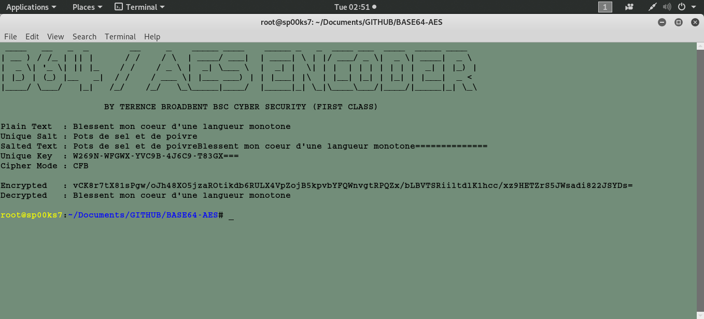

# BASE64-AES
A python script file to create and read BASE64/AES encoded text strings, using a unique salt and a corporate Enterprise key.

Usage: python base64-aes.py

| LANGUAGE | FILENAME | MD5 Hash |
|------    |------    | -------  |
| python | base64-aes.py | MD5 Hash - 4d2af648eda9cfe24849aa9bfe823354. |

## CONSOLE DISPLAY

